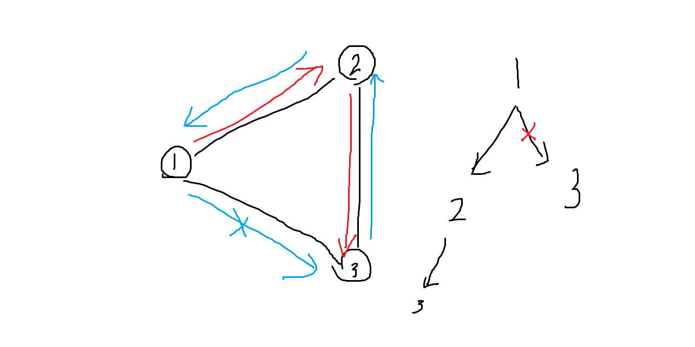

## 풀이 방법

1. 주어진 그래프에서 성별이 다른 대학교와 이어진 간선들만 모두 걸러낸다.
2. 걸러낸 간선들을 이용해 도착할 수 없는 대학교가 있다면 -1를 출력하고 종료한다.
3. 최소 스패닝 트리 알고리즘을 이용해 모든 대학을 잇는 최단 경로를 찾아낸다.

## 틀렸습니다를 받았던 이유

성별이 다른 대학교와 이어진 간선들을 dfs 알고리즘을 이용하여 찾는 로직을 잘못 작성하였다.

대학에 도착했을 때 방문 처리를 하고, 다른 대학으로 이동할 때 방문 여부를 확인했기 때문에 모든 대학교를 방문하지 못했다.

말이 어려운데 그림으로 표현하면 다음과 같다.

