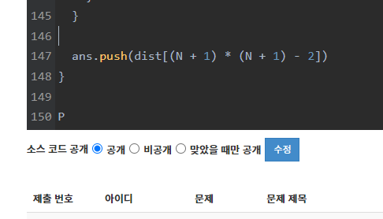

## 풀이 방법

각 좌표에서 상하좌우 인접한 좌표로 이동할 때, 현재 좌표의 루피를 잃는다고 보면 된다.

좌표를 정점으로, 이동 시 잃는 루피를 가중치로 하여 인접 배열을 만들고 최단 경로 알고리즘을 돌려주면 풀리는 간단한 문제이다.

## 삽질

;

예제 테스트케이스가 전부 잘 작동하는 것을 확인하고 제출했는데 틀렸습니다를 받았다.

어디가 잘못되었는지를 한참 분석했는데 정말 어이없게도 복사 붙여넣기 이슈였다.
