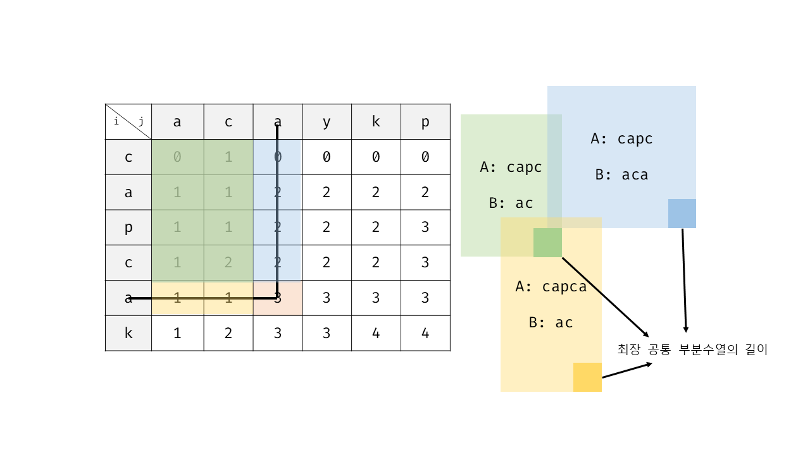

## 1. 무식한 방법

두 문자열에서 모든 길이의 부분 수열을 구해낸 다음, 공통으로 존재하는 부분 수열 중 가장 긴 문자열의 길이를 확인하는 방법이 있다.

$$
\sum_{r=0}^n {_n}C_r = 2^n
$$

한 문자열에서 모든 길이의 연속적인 문자열을 구하는데만 해도 $O(2^n)$ 시간이 걸리게 되어 `n`값이 조금만 커져도 시간초과가 난다.

## 2. Dynamic Programming

최장 부분 공통 문자열(Longest Common Substring) 알고리즘의 아이디어를 조금 변형한 형태이다.

**LCS**ubstring 의 경우 연속적이지 않을 경우 값을 0으로 초기화했다면, **LCS**ubsequence 는 문자열의 특정 위치 이전까지의 최대 공통 부분 수열을 누적해준다.

두 문자열을 각각 A, B 라고 할 때,

$$
dp[i][j] =
\left\{
  \begin{array}{lr}
    dp[i-1][j-1] + 1 & \text{if } A[i] = B[j]\\
    max(dp[i-1][j], dp[i][j-1]) & \text{if } A[i] \neq B[j] \\
  \end{array}
\right.
$$

$A[i] = B[j]$ 일 경우는 $dp[0][0] \sim dp[i-1][j-1]$ 의 공통 부분 수열 중 최대 길이에서 수열의 길이가 하나 증가하는 것이므로 1을 더해주고, 

$A[i] \neq B[j]$ 일 경우는 $dp[0][0] \sim dp[i-1][j]$ 과 $dp[0][0] \sim dp[i][j-1]$ 공통 부분 수열 중 더 큰 부분 수열의 길이를 채택한다는 뜻이다.