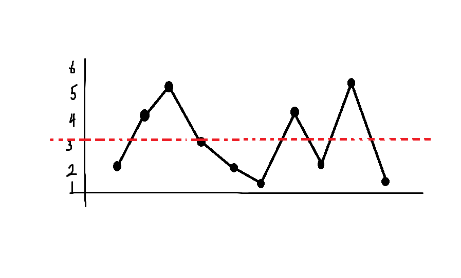

> 효율성 테스트까지 통과할 수 있는 솔루션은 빠르게 찾았지만, 파라메트릭 서치의 결정조건 복잡도 계산과, 이분 탐색의 조건 설정을 제대로 하지 못한 탓에 시간이 걸렸다.

## 풀이 방법

징검다리의 수는 최대 20만이다. 만약 니니즈 친구들을 한명 한명 건너게 하며 디딤돌의 숫자를 줄여나간다면, 디딤돌의 값은 최대 2억이기 때문에 결코 시간안에 값을 구할 수 없을 것이다.



고민을 하다 $\rm stones$ 의 값을 2차원 그래프로 그려보았더니 시간안에 해결할 수 있는 방법이 보였다.

디딤돌에 적힌 숫자를 y축에 표현하였는데, y축의 값은 곧 **건너갈 수 있는 니니즈 친구들의 숫자**라고 생각해도 되는 것이었다.

사진의 그어진 빨간 점선의 경우를 예로 들면, *\"3명의 니니즈 친구들이 징검다리를 건널 수 있는가?\"* 라는 **질문**을 던질 수 있고, 건너뛸 수 있는 디딤돌의 수 `k` 값에 따라 건널 수 있는지를 판단할 수 있다.

|건너뛸 수 있는 디딤돌의 수 (k)|건널 수 있는가|
|-|-|
|3|yes|
|2|no|

3번째 니니즈 친구가 징검다리를 건널 때 연속된 2개의 디딤돌이 이미 0이 되었으므로 `k`값이 2보다 큰 값이어야 건널수 있다.

건널 수 있는 니니즈 친구들의 숫자를 최소 1에서 2억으로 잡고, 중간 값 `m`으로 *\"m명의 니니즈 친구들이 징검다리를 건널 수 있는가?\"* 라는 질문(a.k.a. 결정조건)을 던져가며 범위를 조절<sup><a id="rfn_1" href="#fn_1">[1]</a></sup>해나가는 **파라메트릭 서치**를 이용하면 $\rm O(N \log N)$ 시간안에 정답을 구할 수 있다.


## 실수한 점

1. **파라메트릭 서치의 결정조건의 알고리즘을 올바르게 작성하지 않았다.**

```js{2}
const canGo = (c) => {
  const newStones = stones.map((v) => (v - c <= 0 ? 0 : 1)).join('');
  const zeroStones = Array(Math.min(2e5, k)).fill('0').join('');

  return (
    newStones.indexOf(zeroStones) === -1
  );
};
```

결정 조건을 확인하는 함수 `canGo`는 `c`명이 건너갔을 때의 징검다리 상태를 확인하는 것이므로, 디딤돌의 숫자가 음수일 때 건너지 못하는 상태 `0`으로 판단해야 했는데, 0일 때 에도 건너지 못하는 상태라고 처리했었다. (0이라는 것은 숫자가 1인 디딤돌을 마지막으로 밟고 지나갔다는 것을 의미한다.)

2. **파라메트릭 서치의 결정조건의 알고리즘을 비효율적으로 작성하여 시간초과가 났다.**

```js{2-3}
const canGo = (c) => {
  const newStones = stones.map((v) => (v - c < 0 ? 0 : 1)).join('');
  const zeroStones = Array(Math.min(2e5, k)).fill('0').join('');

  return (
    newStones.indexOf(zeroStones) === -1
  );
};
```

건널 수 있는 디딤돌과 그렇지 않은 디딤돌을 판단할 때, 현재 니니즈 친구들의 인원수에 따라 새로운 배열로 만들어 사용하였는데, 크기가 20만인 배열을 매번 할당하는 과정만으로도 시간초과가 발생하였다.

3. **이분 탐색의 범위 조절과 종료 조건을 제대로 설정하지 않았다.**

이분탐색을 구현할 때 항상 헷갈리는 부분이다. lower/upper bound를 구현할 때에는 또 다르기 때문이다.

나름 이유를 가지고 코드를 작성하였는데 앞으로 파라메트릭 서치를 구현할 땐 다음과 같이 작성하려고 한다.

```js{4, 9, 11}
let l = 1;
let r = 2e8;

while(l <= r) {
  const m = Math.floor((l + r) / 2);
  
  if(canGo(m)) {
    answer = m;
    l = m + 1;
  } else {
    r = m - 1;
  }
}
```

## 각주

<a id="fn_1" href="#rfn_1">[1]</a> 결정 조건 질문에 대한 답이 참이면 니니즈 친구들의 수를 늘리고, 거짓이면 니니즈 친구들의 숫자를 줄인다.